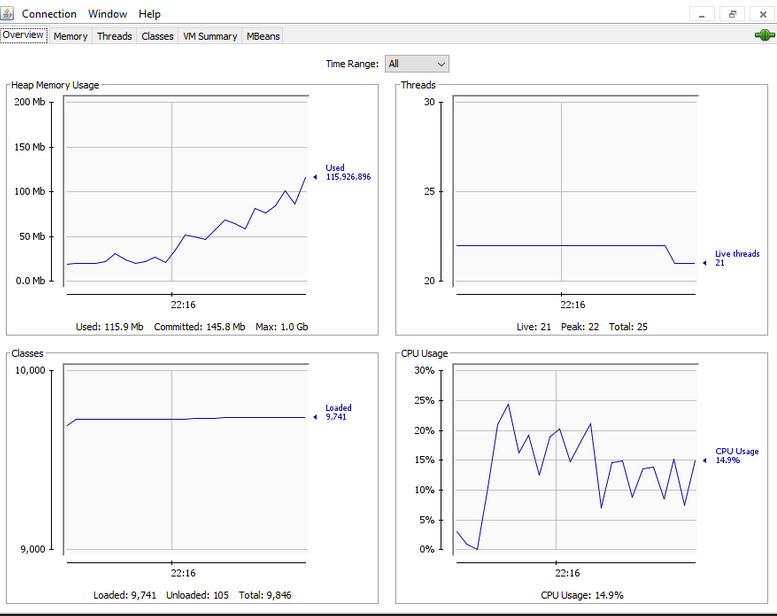
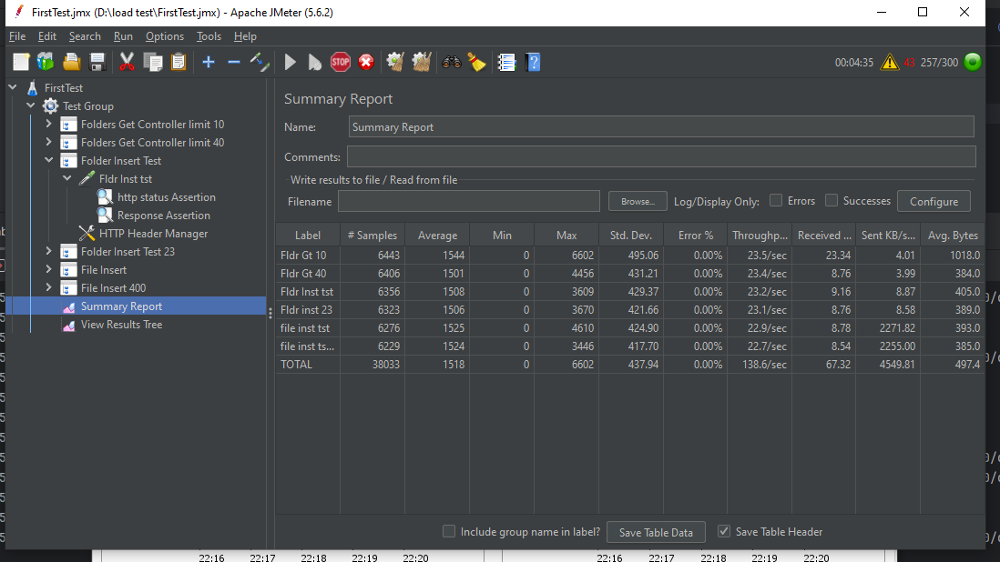

#### Performance test in Apache Jmeter

**Performance Testing:**
Performance testing is the practice of evaluating how a system performs in terms of responsiveness and stability under a particular workload. Performance tests are typically executed to examine speed, robustness, reliability, and application size.
The goal is not finding bugs, but to eliminate performance bottlenecks of the app.

##### Types of performance testing:
1.Load testing
Simulate user load, anticipate users loads, the objective is identifity bottlenecks

2.Stress testing
This involves testing the application under extreme workloads and analyze how it handles the traffic, the objective is identify breaking points

3.Endurance testing
It's done to validate if the application can handle the expected load for long periods of time

4.Spike testing
It simulates large spikes in the load generated y the users

5.Volume testing
Large number of data is populated in the database and overall software, the objective is testing with bit volume of data and the letting ob database volumes

**Jmeter key notes**

Thread group: It is the way to simulate users, it's a root element where located the components and functions to be tested

**State codes HTTP to use assertions**

- 404 Bad request
- 200 OK

##### Jmeter elements
1.**Test plan:** Is the element that contains the configuration and elements necessary to execute the test

2.**Thread group:** It the root element that contains samplers, controllers and go on and on. This is considered the beginning point of a test plan.

3.**Controlers:**

3.1. **Samplers:** Are different types of requests send by the thread group

- FTP
- HTPP
- JDBC
- SMTP

3.2. **Logic controlers:** Let you customize the logic that JMeter uses to decide when to send requests.

- Once Only Controller
- Interleave Controller

3.2.1 **Recroding controller :** 

4.**Listeners :** Show the results of test execution, is like the reporting
Listeners provide access to the information JMeter gathers about the test cases while JMeter runs. The Graph Results listener plots the response times on a graph

5.**Configuration elements:** Here we put variables, defaults variables

6.**Assertions:** The way to validate the response, body, headers, time, status code of each test

Assertions allow you to assert facts about responses received from the server being tested. Using an assertion, you can essentially "test" that your application is returning the results you expect it to.

7.**Timers:**
By default, a JMeter thread executes samplers in sequence without pausing. We recommend that you specify a delay by adding one of the available timers to your Thread Group

8.**Pre-Processor Elements**
A Pre-Processor executes some action prior to a Sampler Request being made.

9.**Post-Processor Elements**
A Post-Processor executes some action after a Sampler Request has been made

##### Listerners
This elements are used to catch and store the results for example:

- Agreggarte result listener
- Graph result
- View results in table
- View results in tree
#### Performance Test Execution Graph
- ##### Resource Usage Graph
### Execution Summary
This graph describes the load test result of  consumption of resources. 

This figure are divided into four portion. i)Heap memory ii) Threads iii) Classes iv) CPU Usage

**Heap Memory:** The heap is a large area of memory available for use by the program. The program can request areas, or “blocks”, of memory for its use within the heap. In order to allocate a block of some size, the program makes an explicit request by calling the heap allocation operation.
  
While executing a Java application, the runtime objects created gets stored in one continuous memory region, which is called the heap.
Heap memory area exhibits the following behaviour
- When an object is created, a portion of the heap is reserved.
- When the heap fills up, those objects which are not in use are removed by the garbage collection
- When the garbage collection runs is triggered, all the application requests goes to a halt stage.
- Heap doesn’t have any limit on memory size.
- It allows you to access variables globally.

In figure the heap memory size is Max: 1.0 Gb.The values of Used memory 115.9 Mb and Committed: 145.8 Mb

**Threads:** This is the count of virtual users that we are expecting to connect to the server. This figure shows that the no. of threads 25 Jmeter will simulate 25 virtual users that connect to the server and perform the same steps given.
             
              JMeter start with 1 thread and add another thread each 4 seconds.
              Once started each thread will begin to execute Samplers.
              When the thread executes the last sampler it will be shut down.
              When the last thread executes the last sampler the test ends.
Depending on the number of samplers and application response time you may or may not achieve 25 users concurrency.
In figure live threads: 21, peak: 22, total: 25

**Classes :** When running Jmeter application  see that Loaded Classes continuously increase up to the point of 100K+ classes loaded.
            Here loaded classes: 9741, unloaded classes: 105, total: 9846

**CPU usage :** The number of threads (user) 300 and Ramp-up period (seconds) 120. After running the application CPU usage 14.9%

### Jmeter Summary

**By referring to the figure:**
* Label: It is the name/URL for the specific HTTP(s) Request.
* Samples: Label 1 -  the number of virtual users per request 6443 and
           total - the number of virtual users per request 38033
* Average:  The average time for Label 1 is 1544  & total average time is 1518 
* Min: The shortest time taken by a sample for specific label. Min value for Label 1 then, out of 6443 samples shortest response time one of the sample had was 0 
* Max: The longest time taken by a sample for specific label.  Max value for Label 1 then, out of 6443 samples longest response time one of the sample had was 6602
* Std. Dev. : The average value of sample response time in Label 1 is 493.06 and the total average value of sample response time is :437.94 
* Error%: Failed request Label 1 is 0.00% and total failed request is 0.00%
* Throughput: 23.5/sec number of request that are processed per second by Label 1 and number of request that are processed per second is 138.6/sec
* Received: The number of request received by Label 1 is 23.34 and the total request received is 67.32
* Sent KB/s: 4.01 KB/sec is the number of request that are processed kilobyte per second by Label 1 and number of request that are processed kilobyte per second is 4549.81 KB/s
* Avg. Bytes: 1018.0 is the average size of the sample response in bytes for Label 1 and the total average size of the sample response in bytes is 497.4

### Workflow

